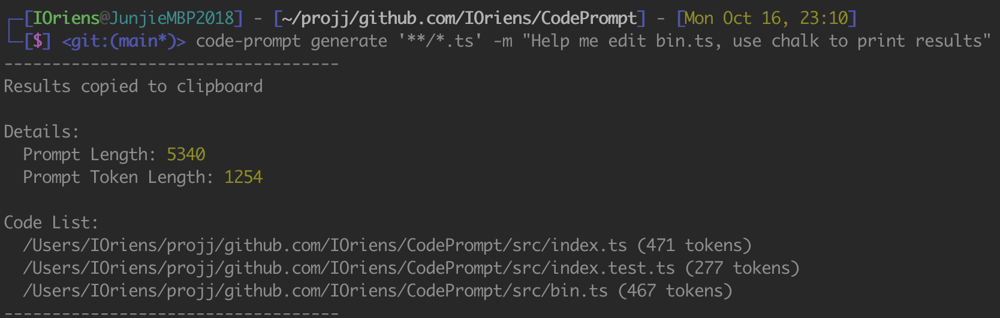
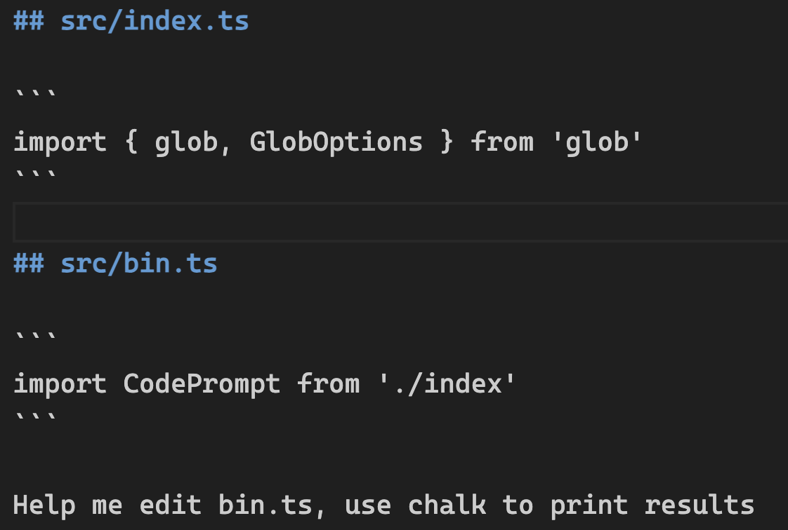

# CodePrompt

**CodePrompt** is a tool that crafts GPT prompts using your local code files. With the flexibility of `glob` patterns, you can effortlessly specify which files to incorporate into your prompt.


## Example

```bash
code-prompt generate '**/*.ts' -m "your prompt"
```

This command will search for all TypeScript files in your directory and its subdirectories. It then crafts a GPT prompt using the contents of these files, followed by the message "your prompt".


| CLI Output | Prompt Result |
|-------------------------|---------------|
|  |  |


## Key Features

- **GPT Prompts**: Craft prompts using code from your local files.
- **File Selection**: Use `glob` patterns to easily select files for prompts.
- **Custom Messaging**: Enhance prompts with custom prefixes or instructions.
- **Token Count**: Employ `tiktoken` for accurate token metrics.
- **Clipboard Integration**: Auto-copy results for quick sharing.
- **CLI**: Efficient command-line interface for prompt generation.

## Quick Installation

```bash
npm install -g code-prompt
```

## How to Use

### As a Library

Incorporate `CodePrompt` directly into your projects for a more programmatic approach.

```typescript
import CodePrompt from 'code-prompt'

const result = await CodePrompt('**/*.ts', {
  prefixPrompt: 'Considering the following code from project XXX...',
  prompt: 'Given the xxx function in xx.ts, how could we optimize it further?',
  copyToClipboard: true,
  cwd: process.cwd(),
})
```

### Command-Line Interface

Dive straight into generating prompts with our command-line tool:

```bash
code-prompt generate <pattern> [options]
```

#### Options:
- `-p, --prefixPrompt <prefixPrompt>`: Set the stage with a custom introduction.
- `-m, --promptMessage <promptMessage>`: The heart of your query or instruction.
- `-i, --ignore <ignore>`: Exclude specific patterns (default: 'node_modules/**').
- `-e, --encodingModel <encodingModel>`: Opt for your desired encoding model (default: 'gpt-4').
- `-c, --copyToClipboard`: Auto-copy results for swift actions (default: true).
- `--cwd <cwd>`: Set your current directory (default: process's current working directory).

#### Example:
```bash
code-prompt generate '**/*.ts' -p "Examining project Y's codebase..." -m "How do we refactor this section for efficiency?"
```

## Join the Community!

Help us in making CodePrompt even better. Open issues, suggest enhancements, or contribute directly by submitting pull requests.

## License

Licensed under the [MIT License](LICENSE.md).
